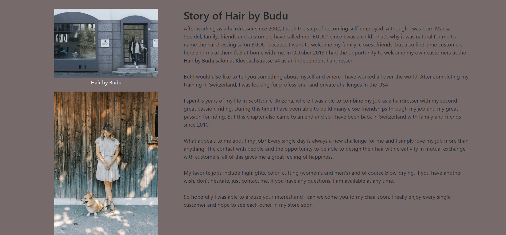

# Hair by Budu
## my-fourth-project:
- [Live Site](https://my-fourth-project-20ac31973068.herokuapp.com/)
- [Repository](https://github.com/EMPZsolt/my-fourth-project)

Welcome aboard to Hair by Budu, where your hair's journey to perfection begins! ✂️

Get ready to embark on a haircare adventure like no other at Hair by Budu, your ultimate destination for exquisite hair styling and rejuvenation. Nestled in the heart of Zürich, our salon is more than just a place to get your hair done – it's a haven where style meets innovation and where every visit promises an unforgettable experience.

Prepare to indulge in a world of luxurious treatments, expert styling, and personalized attention, all tailored to unleash the true potential of your locks. From trendy haircuts to vibrant color transformations, our skilled team of hairstylists is dedicated to bringing your hair dreams to life, one strand at a time.

But Hair by Budu is not just about transforming your hair – it's about transforming your entire outlook on beauty and self-care. Step into our salon and leave your worries at the door as you immerse yourself in a world of relaxation and rejuvenation. With every visit, you'll not only leave looking fabulous but feeling rejuvenated and empowered from within.

So whether you're looking to refresh your look, revitalize your locks, or simply pamper yourself with a little self-care, Hair by Budu is here to make it happen. Get ready to embark on a hair journey like no other and discover the true potential of your locks at Hair by Budu.

## Table of Contents
- [Hair by Budu](#hair-by-budu)
  - [Table of Contents](#table-of-contents)
- [User-Experience-Design](#user-experience-design)
  - [The-Strategy-Plane](#the-strategy-plane)
    - [Site-Goals](#site-goals)
    - [Agile Planning](#agile-planning)
      - [Epics](#epics)
      - [User Stories](#user-stories)
  - [The-Scope-Plane](#the-scope-plane)
  - [The-Structure-Plane](#the-structure-plane)
    - [Features](#features)
    - [Features Left To Implement](#features-left-to-implement)
  - [The-Skeleton-Plane](#the-skeleton-plane)
    - [Database-Design](#database-design)
    - [Security](#security)
  - [The-Surface-Plane](#the-surface-plane)
    - [Design](#design)
      - [Color-Scheme](#color-scheme)
      - [Typography](#typography)
      - [Imagery](#imagery)
  - [Technolgies](#technolgies)
  - [Testing](#testing)
  - [Deployment](#deployment)
    - [Heroku Deployment](#heroku-deployment)
    - [Run Locally](#run-locally)
    - [Fork Project](#fork-project)
  - [Credits](#credits)
    - [Code Used](#code-used)
    - [Content](#content)
    - [Media](#media)
    - [Acknowledgments](#acknowledgments)

# User-Experience-Design

## The-Strategy-Plane

### Site-Goals

The Hair by Budu website has been designed to provide seamless customer service and centralize the owner's work. It aims to simplify the management of salon services and appointments while providing customers with an easy booking process.

For salon staff, the website makes it easy to manage the services offered, schedule appointments and track availability. Staff can efficiently edit or remove services as needed, ensuring accurate display on the website.

For customers, the website provides a user-friendly platform for browsing available services, making reservations and managing reservations. Customers can easily schedule an appointment without calling and have the flexibility to change or cancel reservations if needed.

### Agile Planning

The development of the Hair by Budu website followed agile methods, focusing on iterative development and delivering features in small increments.

The project was divided into three sprints that lasted one week each. Features have been categorized into epics and the user stories ranked by importance. They are labeled as 'Must have', 'Should have',  'Could have' and 'Won't have' to ensure that core features are covered first and optional features second.

Tasks were organized on a Kanban board ([here](https://github.com/users/EMPZsolt/projects/2)) using GitHub Projects, allowing transparent tracking of progress. Each user story included a set of acceptance criteria to determine termination conditions.

An agile approach ensured that core features were implemented first and additional features were added as capacity allowed, resulting in a well-rounded site that met both essential and desirable requirements.

#### Epics

The project had 7 main Epics (milestones):

**EPIC 1 - Base Setup**

The base setup epic is for all stories needed for the base set up of the application. Without the base setup, the app would not be possible so it was the first epic to be delivered as all other features depend on the completion of the base setup.

**EPIC 2 - Booking page**

The stand alone pages epic is for small pages that did not have enough stories to warrant their own full epics. Instead of creating epics for tiny features, these small deliverables were all added under this epic.

**EPIC 3 - Home page**

The authentication epic is for all stories related to the registration, login and authorization of views. This epic provides critical functionality and value as without it the staff would not be able to managed the bookings securely without regular site visitors also being able to see and perform actions.

**EPIC 4 - About page**

The menu epic is for all stories that relate to the creating, deleting, editing and viewing of menus. This allows for regular users to view menus and for staff to manage them with a simple UI interface.

**EPIC 5 - Gallery page**

The booking epic is for all stories that relate to creating, viewing, updating and deleting bookings. This allows the staff to easily view upcoming bookings, manage the bookings and also for customers to book and manage their own reservations.

**EPIC 6 - Information page**

This epic is for all stories related to deploying the app to heroku so that the site is live for staff and customer use.

**EPIC 7 - Documentation**

This epic is for all document related stories and tasks that are needed to document the software development lifecycle of the application. It aims to deliver quality documentation, explaining all stages of development and necessary information on running, deploying and using the application.

#### User Stories

The following user stories (by epic) were completed over the 3 sprints:

**EPIC 1 - Base setup**

As a developer, I can set up the project so that the core features can be implemented.

As a developer, I can create static files so that css, images and javascript work on the website.

As a developer, I can create the base.html so that other pages can rely on the layout.

As a developer, I can create the navbar so that users can navigate between the sites of the website.

As a developer, I can create the footer with contact information and Instagram-Facebook links.

As a developer, I can build the home app so that I can see thr first look of the website and test that everything is working so far.

**EPIC 2 - Booking page**

As a user, I can book a haircut appointment online so that I can conveniently schedule my haircut appointments without visiting the salon physically.

As a user, I can view the details of my booking after submission so that I can verify the accuracy of my booking information and make any necessary changes if required.

As a user, I receive confirmation of a successful booking so that I have assurance that my booking has been successfully processed.

As a user, I can only book from the next day and only on open days so that my booking will be clear and simple for both the user and the staff.

**EPIC 3 - Home page**

As an admin, I can manage the main image displayed on the home page so that I can ensure it is attractive, relevant, and aligns with the salon's branding and theme.

As an admin, I can customize the welcome message displayed on the home page so that I can personalize the greeting for visitors.

As a visitor, I want a visible booking button on the home page so that I can easily schedule an appointment.

As a signed up user, I can read and write comments so that I can make informed decisions and share feedback with the salon community.

**EPIC 4 - About page**

As a user, I can view the salon profile image and story so that I can get to know and feel closer to the owner and the business.

As a user, I can see the owner's profile image and name so that I connect with the salon's owner on a personal level.

As an admin, I can manage about page content so that ensure the about page reflects accurate and current information about the salon.

As an admin, I can upload owner's profile image and name so that I maintain a professional and personalized presentation of the salon owner to visitors.

**EPIC 5 - Gallery page**

As a user, I can view salon images in a slideshow so that I easily browse the various salon images to get a comprehensive view of the salon's look, offerings and aesthetics.

As a user, I can view hairstyle images in a slideshow so that I can get to know the main hair styles made in the salon, attracting my attention and interest.

As an admin, I can manage salon images in the gallery so that ensure the gallery showcases the latest and most relevant salon images, reflecting the salon's current offerings and aesthetics.

**EPIC 6 - Information page**

As a user, I can view detailed information about salon services categorized for women, men, and kids so that I can understand the range of services offered by the salon.

As a user, I can view the salon's opening hours so that I can plan my visit based on the salon's operating hours.

As a user, I can view the salon's location displayed on a map so that I can easily locate the salon and plan my visit accordingly.

As a user, I can view accessibility information for the salon location so that I can plan my visit considering transportation and parking options.

**EPIC 7 - Documentation**

Complete readme documentation

Complete testing documentation

## The Scope Plane

The objective of the Hair by Budu salon website is to provide an online platform for customers to explore the salon's services, make appointments, and interact with the salon staff. The website aims to streamline the booking process, enhance customer experience, and showcase the salon's expertise in hair care and styling.

**Target Audience**

The target audience for the Hair by Budu salon website includes individuals of all ages and genders looking for professional hair care services. This includes existing customers seeking appointment scheduling convenience and new customers interested in exploring the salon's offerings.

**Success Criteria**

Positive feedback from customers regarding the ease of use and functionality of the booking system.
Growth in website traffic and engagement metrics, including page views, session duration, and return visits.
Expansion of the salon's customer base through effective online marketing and promotion strategies.

## The-Structure-Plane

### Features

**Navigation Menu**

 The Navigation contains links for Home, About, Gallery, Information, Booking and has allauth options. In addition, the logo of the salon can be found at the beginning of the navbar, which always leads back to the home page. It is a clear and intuitive navigation menu, allowing users to easily explore different sections of the website. This menu enhances user navigation and facilitates quick access to key information, such as services offered, booking options, salon information, and more.

The following navigation items are available on all pages:
  * Home -> home_page.html - Visible to all
  * About -> about_page.html - Visible to all
  * Gallery -> gallery_page.html - Visible to all
  * Information -> information_page.html - Visible to all
  * Booking -> book_service -> booking_details.html - Visible to logged in users
  * Login -> login.html - Visible to logged out users
  * Register -> signup.html - Visible to logged out users
  * Logout -> logout.html - Visible to logged in users

The navigation menu is displayed on all pages and drops down into a hamburger menu on smaller devices. This will allow users to view the site from any device and not take up too much space on mobile devices.

**Footer**

A footer has been added to the bottom of the site, this contains a Facebook and Instagram links so that users can follow the salon on social media if they want to keep up to date with news not advertised on the website. To enhance accessibility, aria-labels have been added to the social media icons, ensuring users with assistive screen reading technology understand the purpose of the links. Additionally, these links open in new tabs to prevent users from navigating away from the site.

**Home Page**

The Home page of Hair by Budu features an inviting hero image and warm greeting message, fostering a positive connection with visitors. It's designed for seamless viewing across devices, with a prominent "Book Now" button for convenient appointment scheduling. Animated elements add visual interest, while branding elements reinforce the salon's identity.

**About Page**

The About page plays a prominent role as the central point of presenting the business. This page provides users with the opportunity to learn about the salon's history, philosophy, and values while building a personal connection with the salon owner. The salon's profile image and story are presented in an engaging and captivating manner, while the owner's profile is showcased in a personalized and professional manner. The Features section details the functionalities of the About page, including dynamic content management and professional owner presentation. Administrators have full control over the content displayed on the site and can easily update the salon's history and the owner's profile. Together, these features reinforce the credibility and attractiveness of the site while fostering a personal connection between users and the business. The Hair by Budu website is a platform that not only offers hairdressing services but also provides a genuine experience and connection between visitors and the salon.

**Gallery Page**

The Gallery page showcases a collection of high-quality images, allowing users to explore the salon's ambiance and diverse range of hairstyles through a slideshow. Users can easily browse through salon images to get an overview of the salon's look and offerings, as well as discover various hairstyle options.

**Information Page**

The Information page provides users with detailed information about salon services tailored for women, men, and kids, all presented within an elegant frame, allowing them to understand the range of services offered. Users can also access the salon's opening hours to plan their visit accordingly and view the salon's location on a map for easy navigation. Additionally, accessibility information is provided to help users plan their visit considering transportation and parking options.

**Booking page**

The Booking page allows users to manage their haircut appointments conveniently. Users can view their existing bookings, including the name, preferred date, and time for each appointment. They also have the option to modify or delete bookings as needed. A confirmation modal is provided for deleting bookings, ensuring that users are aware of the irreversible action. Additionally, users can book a new appointment by filling out the booking form with their desired date and time. The form is equipped with CSRF protection for security. Upon submission, users receive feedback messages confirming the success of their booking. The page layout is designed to be user-friendly, with clear instructions and intuitive buttons for easy navigation. JavaScript functionality is included to enhance the user experience, ensuring smooth interactions with the booking form and confirmation modal.

**Booking details**

The Booking Details page allows users to modify their existing haircut appointments. Upon accessing the page, users are presented with a booking modification form, neatly displayed within a container. The form is designed to be user-friendly, featuring clear labels and input fields for editing booking details such as the name, preferred date, and time. To ensure security, the form includes a CSRF token.

The JavaScript code integrated into the page enhances several aspects of functionality. Firstly, it contributes to the seamless data submission process, ensuring that user modifications are accurately captured and processed by the system. Additionally, it facilitates the modify function, enabling users to efficiently update their booking information with ease. Furthermore, the JavaScript code plays a crucial role in managing bookings based on the salon's operating hours. It incorporates functionality to restrict booking dates to only open days, as indicated in the salon's calendar. If a user attempts to select a date outside of the open days, a message is displayed informing the user that these days are not available for booking as the salon is closed. This feature enhances user experience by providing clear guidance and preventing booking errors.

Overall, the Booking Details page, with the integration of JavaScript functionality, offers users a smooth and intuitive experience for modifying their appointments, while also ensuring bookings adhere to the salon's operating hours for improved efficiency and accuracy.

**404 Page**

As a developer, I need to implement a 404 error page to redirect users to original home page. It has been implemented and will display if a user navigates to a broken link and will allow the user to easily navigate back to the main website if they direct to a broken link / missing page, without the need  of the browsers back button.

**403 Page**

A 403 error page has been implemented to provide feedback to the user when they try to access unauthorized content. Users will be directed to this page if they alter the URL's and attempt to edit, delete or access pages that are restricted. 

This covers:
* Edit Booking - Only authorized to the client who created the booking
* Delete booking - Only authorized to the client who created the booking

**500 Page**

A 500 error page has been displayed to alert users when an internal server error occurs. The message relays to users that the problem is on our end, not theirs.

**Favicon**

A favicon was added the website to enable users to easily locate the website in the browser when multiple tabs are open.

### Features Left To Implement
- Integration with social media platforms for sharing customer reviews and testimonials.
- Comment section option to receive salon feedback directly through the site, not having to rely on social media
- Blog section for sharing hair care tips, trends, and industry news.
- Integration with an online store for selling hair care products recommended by the salon.
- Automatic cancellation of expired bookings.

## The Skeleton Plane

### Database-Design

The database architecture of the project is designed to facilitate user authentication and booking management seamlessly.

- auth_permission Table: This table stores permissions granted to users. Each permission is associated with a unique ID, name, codename, and content type ID.

- auth_user_user_permissions Table: This table establishes a many-to-many relationship between users and permissions. It stores the IDs of permissions assigned to each user.

- auth_user Table: The core of user authentication is managed through this table. It stores user information such as their first name, last name, username, email, password hash, and other details. Additionally, it tracks login activities including the user's last login timestamp and their status as a superuser or staff member.

- booking_booking Table: This table captures booking details, including the customer's name, phone number, email, preferred date and time for the booking, service type, any additional notes, and the timestamp of when the booking was created. The relationship between the user and their bookings is established through a one-to-many relationship, as each user can have multiple bookings associated with their account.

The database schema adheres to relational database principles, ensuring efficient data management and seamless interactions between users and the booking system.

Entity relationship diagram was created using [DBEAVER](https://dbeaver.io/) and shows the schemas for each of the models and how they are related.

### Security

The built-in user authentication and authorization features of the Django framework ensure that only authorized users have access to the project's functionalities. For example, the auth_user table and its related built-in Django functionalities handle user authentication and authorization.

Environment variables were stored in an env.py for local development for security purposes to ensure no secret keys, api keys or sensitive information was added the the repository. In production, these variables were added to the heroku config vars within the project.

## The-Surface-Plane
### Design

#### Color-Scheme

The website uses a palette of basicly pastel colors that represents the salon's main color and the rest complement it well. The color palette was created with the help of the Coolors website.

#### Typography

The font-family is system-ui and it was used throughout the website. This font is from basic selection.

#### Imagery

The Website logo and all the pictures are from Hair by Budu.

## Technolgies
### Languages Used

HTML, CSS, Javascript, Python were used to create this project.

### Libraries & Programs Used

- HTML - The structure of the Website was developed using HTML
- CSS - The Website was styled using custom CSS in an external file
- JavaScript - JavaScript was used to make the modify and delete funcions and to control the bootstrap date picker on the booking page
- Python - Python was the main programming language used for the application using the Django Framework.
- GitHub - Source code is hosted on GitHub
- Git - Used to commit and push code during the development of the Website
- Heroku - To represent the live program
- ElephantSQL - To store and handle the data
- Cloudinary - To store the images online
- Google map API - To represent an online map
- Font Awesome - This was used for various icons throughout the site
- Favicon.io - favicon files were created at https://www.meretezdat.hu/
- TinyPNG - This was used to compress the hero image for optimal load times
- Tiny PNG - To compress images
- FreeConvert - To compress images in the webp format
- Am I Responsive? - To show the website image on a range of devices
- Paint - To cut the images to the right size

**Python Modules Used**

Database and Model Management:
* django.db.models: Used for defining database models.
* django.contrib.auth.models.User: Used for user management.

Validation and Error Handling:
* django.core.exceptions.ValidationError: Used for handling validation errors.

Translation Support:
* django.utils.translation.gettext_lazy: Used for translation management.

Date and Time Handling:
* datetime.date: Used for representing and handling dates.
* datetime.timedelta: Used for representing and handling time intervals.

**External Python Modules**

* cloudinary==1.36.0 - Cloundinary was set up for use but no custom uploads were made, settings remain for future development
* crispy-bootstrap5==0.7 - This was used to allow bootstrap5 use with crispy forms
* annotated-types==0.6.0: Provides support for type annotations in Python.
* asgiref==3.7.2: ASGI (Asynchronous Server Gateway Interface) reference implementation and ASGI utilities.
* dj-database-url==0.5.0: Enables you to utilize the DATABASE_URL environment variable to configure Django apps.
* dj3-cloudinary-storage==0.0.6: A Django storage backend for Cloudinary, allowing you to store media files in the Cloudinary service.
* Django==4.2.9: A high-level Python web framework that encourages rapid development and clean, pragmatic design.
* django-allauth==0.57.0: Provides a set of Django applications to handle authentication, registration, account management, and other user management tasks.
* django-bootstrap-datepicker-plus==5.0.5: Django widget for Bootstrap Datepicker Plus, allowing easy integration of date pickers in Django forms.
* django-cloudinary-storage==0.3.0: A Django storage backend for Cloudinary, similar to dj3-cloudinary-storage but possibly for an older version of Django.
* django-crispy-forms==2.1: Django application to control the rendering behavior of Django forms in a DRY way.
* django-summernote==0.8.20.0: Django integration with Summernote, a WYSIWYG (What You See Is What You Get) editor.
* gunicorn==20.1.0: A Python HTTP server for WSGI (Web Server Gateway Interface) applications. It's commonly used to deploy Django applications in production.
* oauthlib==3.2.2: A generic, spec-compliant, thorough implementation of the OAuth request-signing logic.
* pillow==10.2.0: The Python Imaging Library (PIL) fork. It adds support for opening, manipulating, and saving many different image file formats.
* psycopg2==2.9.9: PostgreSQL database adapter for Python. It enables Python programs to access PostgreSQL databases.
* pydantic==2.6.0: A data validation and settings management library for Python. It's particularly useful for data validation and parsing.
* pydantic_core==2.16.1: Core library for Pydantic, providing data validation and parsing capabilities.
* PyJWT==2.8.0: A Python library that allows you to encode and decode JSON Web Tokens (JWTs).
* python3-openid==3.2.0: A set of Python libraries for working with OpenID Connect and OAuth 2.0.
* requests-oauthlib==1.3.1: OAuthlib authentication support for Requests, a Python HTTP library.
* sqlparse==0.4.4: A non-validating SQL parser module for Python. It provides support for parsing, splitting, and formatting SQL statements.
* urllib3==1.26.18: A powerful, user-friendly HTTP client library for Python.
* whitenoise==5.3.0: A simple middleware that allows you to serve static files directly from Django, without the need for a separate web server like Nginx or Apache. It's often used in production deployments to improve performance.

## Testing

Test cases and results can be found in the [TESTING.md](TESTING.md) file. This was moved due to the size of the file.

## Deployment

### Heroku Deployment

The site was deployed to Heroku. The steps to deploy are as follows:

- Navigate to heroku and create an account
- Click the new button in the top right corner
- Select create new app
- Enter app name
- Select region and click create app
- Click the resources tab and search for Heroku Postgres
- Select hobby dev and continue
- Go to the settings tab and then click reveal config vars
- Add the following config vars:
  - SECRET_KEY: (Your secret key)
  - DATABASE_URL: (This should already exist with add on of postgres)
  - CLOUNDINARY_URL: (cloudinary api url)
- Click the deploy tab
- Scroll down to Connect to GitHub and sign in / authorize when prompted
- In the search box, find the repositoy you want to deploy and click connect
- Scroll down to Manual deploy and choose the main branch
- Click deploy

The app should now be deployed.

### Run Locally

Navigate to the GitHub Repository you want to clone to use locally:

- Click on the code drop down button
- Click on HTTPS
- Copy the repository link to the clipboard
- Open your IDE of choice (git must be installed for the next steps)
- Type git clone copied-git-url into the IDE terminal

The project will now have been cloned on your local machine for use.

### Fork Project

Most commonly, forks are used to either propose changes to someone else's project or to use someone else's project as a starting point for your own idea.

- Navigate to the GitHub Repository you want to fork.

- On the top right of the page under the header, click the fork button.

- This will create a duplicate of the full project in your GitHub Repository.

 ## Credits
 ### Code Used

- Some of the code comes from the Code Institute sample project.

 ### Content

- I used the CodeInstitute "I Think Therefore I Blog" portfolio project for the basic structure.

 ### Media

 - The frame for the service section is from: https://freefrontend.com/css-frames/

 ### Acknowledgments

 I would like to acknowledge the following people who helped me along the way in completing my third milestone project:
 - My wife, who gave me ideas and supported me through the project.
 - My Mentor, Graeme Taylor, who showed the direction, helped and encouraged me.
 - To Code Institute Tutors, who helped me a lot when I was stucked.
 - Thank you to entire Code Isntitute for making my development possible.