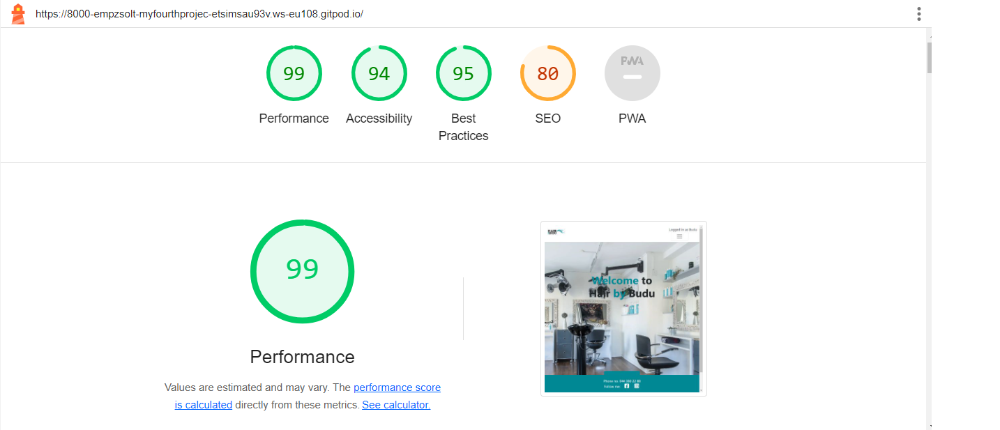

## Functional Testing

**Authentication**

Description:

Ensure a user can sign up to the website

Steps:

1. Navigate to [Hair by Budu](https://my-fourth-project-20ac31973068.herokuapp.com/) and click Register
2. Enter username, email and password 
3. Click Sign up

Expected: 

The main page should appear and a short message that the user is logged in should appear in the upper right corner of the navbar, registration is successful

Actual: 

The main page should appear and a short message that the user is logged in should appear in the upper right corner of the navbar, registration is successful

Description:

Ensure a user can log in once signed up

Steps:
1. Navigate to [Hair by Budu](https://my-fourth-project-20ac31973068.herokuapp.com/)
2. Enter login detailscreated in previous test case
3. Click login

Expected:

User is successfully logged in and redirected to the home page

Actual:

User is successfully logged in and redirected to the home page

Description:

Ensure a user can sign out

Steps:

1. Login to the website
2. Click the logout button
3. Click confirm on the confirm logout page

Expected:

User is logged out

Actual:

User is logged out

**Booking Form**

Description:

Ensure a new booking can be created.

Steps:

1. Navigate to [Booking](https://my-fourth-project-20ac31973068.herokuapp.com/booking/book-service/) - Login if prompted.
2. Enter the following:
    - Name: Lori
    - Email: lori@gmail.com
    - Phone number: Any phone number
    - Service type: Choose any from drop down field
    - Notes: It is not mandatory to fill it out
    - Date preference: Choose a date from tomorrow, but be careful, don't pich Sunday, Monday or Tuesday(the salon is closed)
    - Time preference: Choose any time
3. Click Create

Expected:

Form successfully submits and a message is shown to alert the user of successful booking.

Actual:

Form successfully submits and a message is shown to alert the user of successful booking.

 

Description:

Ensure a booking can be edited.

Steps:

1. Navigate to [Booking](https://my-fourth-project-20ac31973068.herokuapp.com/booking/book-service/) - Login if prompted.
2. Select the booking and click on modify
3. Change this:
    - Time preference: Choose a time 15 min later
4. Click Modify Booking

Expected:

Form successfully submits and a message is shown to alert the user of updated booking.

Actual:

Form successfully submits and a message is shown to alert the user of updated booking.

Description:

Ensure user can successfully delete a booking.

Steps:
1. Login as a user with a booking or create a new booking
2. Click the Delete buttom next to the booking
3. Click the confirm button on the delete modal

Expected:

Booking is successfully deleted

Actual:

Booking is successfully deleted

**Navigation Links**

Testing was performed to ensure all navigation links on the respective pages, navigated to the correct pages as per design. This was done by clicking on the navigation links on each page.

- Home -> home_page.html
- About -> about_page.html
- Gallery -> gallery_page.html
- Information -> information_page.html
- Booking -> book_service -> booking_details.html
- Logout -> Sign out all auth page
- Login -> Sign in all auth page
- Register -> Sign up all auth page

All navigation links directed to the corect pages as expected.

**Footer**

Testing was performed on the footer links by clicking the font awesome icons and ensuring that the facebook icon opened facebook in a new tab and the Instagram icon opened Instagram in a new tab. These behaved as expected.

## Negative Testing

Tests were performed on the create booking to ensure that:

1. A user cannot book a date in the past
2. A user cannot book a date on closed days
3. Forms cannot be submitted when required fields are empty

## Accessibility

[Wave Accessibility](https://wave.webaim.org/) tool was used throughout development and for final testing of the deployed website to check for any aid accessibility testing.

Testing was focused to ensure the following criteria were met:

- All forms have associated labels or aria-labels so that this is read out on a screen reader to users who tab to form inputs
- Color contrasts meet a minimum ratio
- Heading levels are not missed or skipped to ensure the importance of content is relayed correctly to the end user
- All content is contained within landmarks to ensure ease of use for assistive technology, allowing the user to navigate by page regions
- All not textual content had alternative text or titles so descriptions are read out to screen readers
- HTML page lang attribute has been set
- Aria properties have been implemented correctly
- WCAG 2.1 Coding best practices being followed

## Validator Testing

All pages were run through the [w3 HTML Validator](https://validator.w3.org/). Initially there were some errors due to stray script tags, misuse of headings within spans and some unclosed elements. All of these issues were corrected and all pages passed validation.

Due to the django templating language code used in the HTML files, these could not be copy and pasted into the validator and due to the secured views, pages with login required or a secured view cannot be validated by direct URI. To test the validation on the files, open the page to validate, right click and view page source. Paste the raw html code into the validator as this will be only the HTML rendered code.

## Lighthouse Report

Lighthouse report showed areas for improvement on SEO and Best practices. Meta descriptions and keywords were added to boost the SEO to 100 but the best practice warnings were coming from the use of an embedded iframe's javascript. Unfortunately I did not find a way to improve this as I am not initialising the google map iframe with javascript.

## Responsiveness

All pages were tested to ensure responsiveness on screen sizes from 320px and upwards as defined in WCAG 2.1 Reflow criteria for responsive design on Chrome, Edge, Firefox and Opera browsers.
